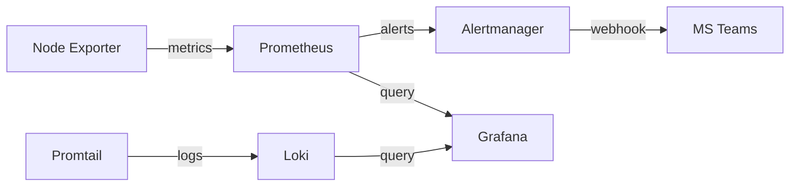
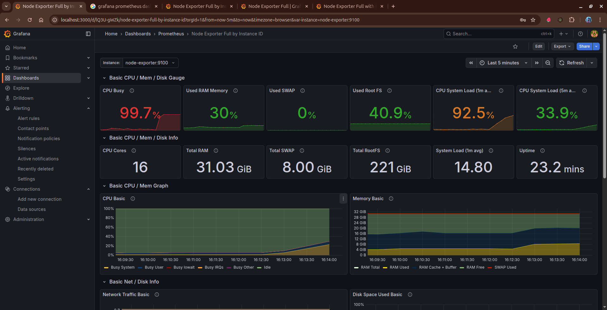
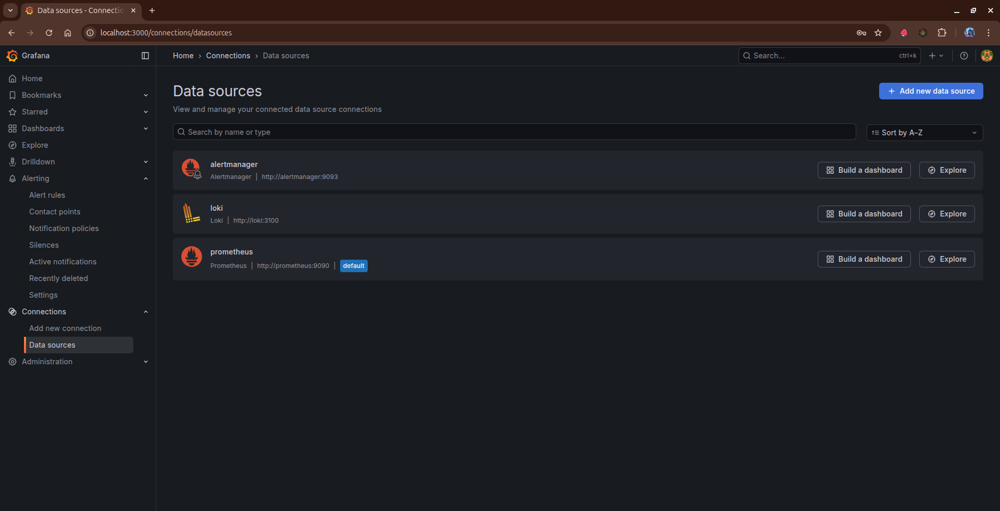
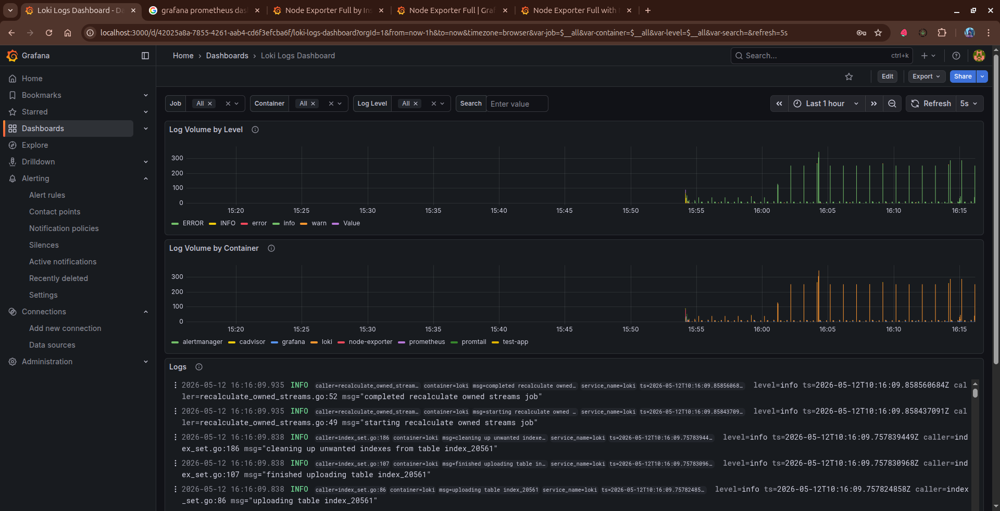
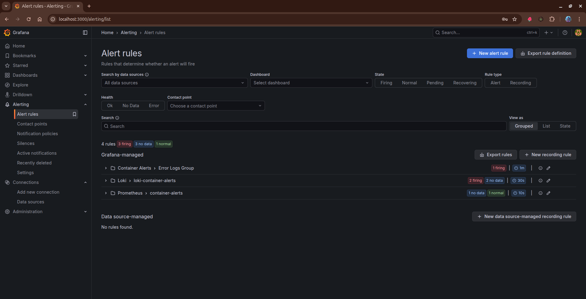

# Azure Observability Stack

Production-ready monitoring and observability stack for cloud infrastructure, built with Docker Compose.

## Tech Stack

- **Prometheus** — Metrics collection and alerting
- **Grafana** — Visualization and dashboards
- **Loki** — Log aggregation
- **Promtail** — Log shipping agent
- **Alertmanager** — Alert routing and notifications
- **Node Exporter** — Host-level metrics

## Architecture



For a detailed architecture breakdown, see [diagrams/architecture.md](diagrams/architecture.md).

## Project Structure

```
azure-observability-stack/
├── prometheus/
│   ├── prometheus.yml     # Scrape configuration
│   └── alert-rules.yml    # Alerting rules
├── grafana/
│   ├── dashboards/        # Dashboard JSON files
│   └── provisioning/      # Datasource and dashboard provisioning
├── loki/                  # Loki log aggregation config
├── promtail/              # Promtail log collector config
├── alertmanager/          # Alertmanager routing config
├── exporters/             # Custom exporter configs
├── diagrams/              # Architecture diagrams
├── docs/                  # Deployment and troubleshooting guides
└── docker-compose.yml     # Stack orchestration
```

## Prerequisites

- Docker Engine 20.10+
- Docker Compose v2.0+
- Minimum 2GB RAM available for the stack

## Quick Start

```bash
# Clone and enter the directory
git clone https://github.com/ihkokil/azure-observability-stack.git
cd azure-observability-stack

# Configure environment
cp .env.example .env
# Edit .env with your Grafana password and Teams webhook URL

# Launch the stack
docker compose up -d

# Verify everything is running
docker compose ps
```

For detailed setup instructions, see the [Deployment Guide](docs/DEPLOYMENT.md).

## Service Endpoints

| Service       | URL                    | Description                |
|---------------|------------------------|----------------------------|
| Prometheus    | http://localhost:9090   | Metrics & query engine     |
| Grafana       | http://localhost:3000   | Dashboards & visualization |
| Alertmanager  | http://localhost:9093   | Alert management UI        |
| Loki          | http://localhost:3100   | Log aggregation API        |
| Node Exporter | http://localhost:9100   | Host metrics (internal)    |

## Grafana

Default credentials:

- **Username:** `admin`
- **Password:** `admin` (change via `GF_SECURITY_ADMIN_PASSWORD` in `.env`)

### Provisioned Dashboards

- **Linux System Dashboard** — CPU, memory, disk I/O, network, and filesystem metrics from Node Exporter




Dashboards are auto-provisioned on startup. To add new dashboards, drop JSON files into `grafana/dashboards/`.

### Datasources

Both Prometheus and Loki are auto-provisioned as Grafana datasources on first boot.




## Centralized Logging

The stack uses **Loki** for log aggregation and **Promtail** as the log collector.

- Promtail discovers Docker containers via the Docker socket
- Container logs are scraped from `/var/lib/docker/containers/`
- System logs are collected from `/var/log/*.log`
- Query logs in Grafana using LogQL:

```logql
{job="docker"} |= "error"
{container="prometheus"} | logfmt | level="error"
```




## Alerting

Alerts are evaluated by Prometheus and routed through Alertmanager to Microsoft Teams.

### Configured Alert Rules

| Alert            | Condition                | Severity | Duration |
|------------------|--------------------------|----------|----------|
| HighCPUUsage     | CPU usage > 80%          | warning  | 5m       |
| HighMemoryUsage  | Memory usage > 85%       | warning  | 5m       |
| HostDown         | Target unreachable       | critical | 2m       |




### Microsoft Teams Setup

1. Create an **Incoming Webhook** connector in your Teams channel
2. Set the webhook URL in `.env`:

```
TEAMS_WEBHOOK_URL=https://outlook.office.com/webhook/your-actual-url
```

3. Restart: `docker compose restart alertmanager`

## Troubleshooting

Common issues and solutions are documented in the [Deployment Guide](docs/DEPLOYMENT.md#troubleshooting).

Quick checks:

```bash
# View logs for a specific service
docker compose logs <service-name>

# Validate Prometheus config
docker exec prometheus promtool check config /etc/prometheus/prometheus.yml

# Check Prometheus targets
curl -s http://localhost:9090/api/v1/targets | jq '.data.activeTargets[] | {job: .labels.job, health: .health}'
```

## License

This project is provided as-is for educational and production use.
