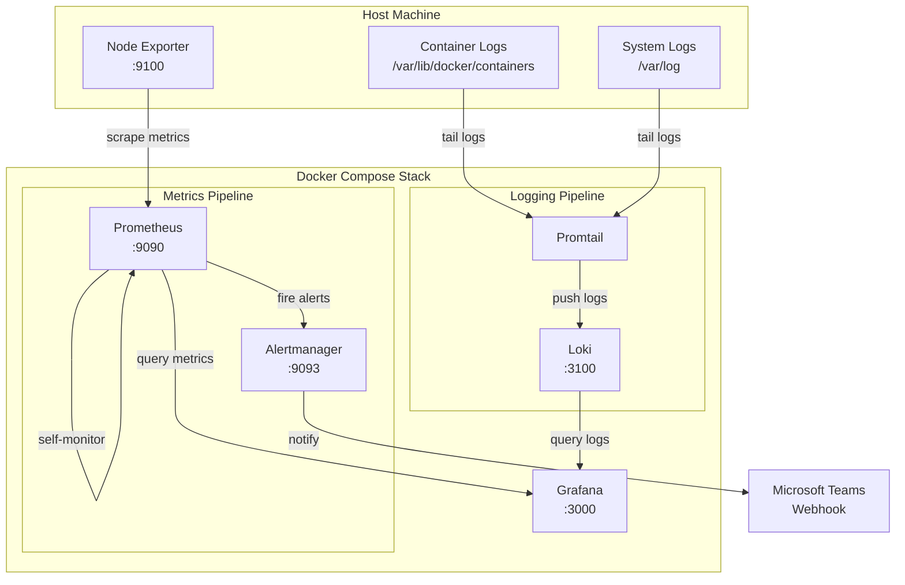

# Architecture Overview

## Stack Topology

## Data Flow

### Metrics Collection

1. **Node Exporter** exposes host-level metrics (CPU, memory, disk, network) on port 9100
2. **Prometheus** scrapes metrics from Node Exporter and itself every 15 seconds
3. Metrics are stored in Prometheus TSDB with 30-day retention
4. **Grafana** queries Prometheus to render dashboards

### Log Aggregation

1. **Promtail** discovers Docker containers via the Docker socket
2. Container logs and system logs are tailed and labeled
3. Logs are pushed to **Loki** via the HTTP API
4. **Grafana** queries Loki using LogQL for log exploration

### Alert Pipeline

1. **Prometheus** evaluates alert rules every 15 seconds
2. When a rule fires, the alert is sent to **Alertmanager**
3. **Alertmanager** groups, deduplicates, and routes alerts
4. Notifications are delivered to **Microsoft Teams** via webhook

## Port Mapping

| Service       | Internal Port | External Port | Protocol |
|---------------|---------------|---------------|----------|
| Prometheus    | 9090          | 9090          | HTTP     |
| Grafana       | 3000          | 3000          | HTTP     |
| Alertmanager  | 9093          | 9093          | HTTP     |
| Loki          | 3100          | 3100          | HTTP     |
| Node Exporter | 9100          | —             | HTTP     |
| Promtail      | 9080          | —             | HTTP     |

## Storage Volumes

| Volume             | Purpose                    | Mounted At          |
|--------------------|----------------------------|---------------------|
| prometheus_data    | Time series database       | /prometheus         |
| grafana_data       | Dashboards, plugins, state | /var/lib/grafana    |
| loki_data          | Log chunks and index       | /loki               |
| alertmanager_data  | Silence and notification state | /alertmanager   |
